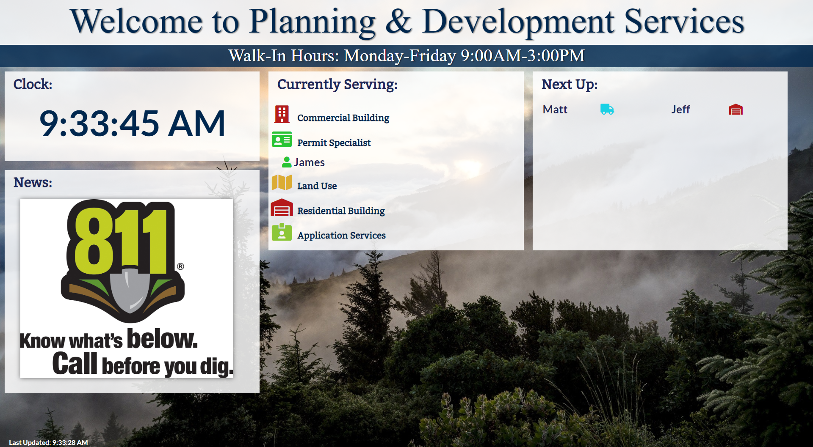

# Queue Monitor

The Queue Monitor is a simple webpage built in coordination with our customer Tracking application (Tracker) to display customers waiting for departments in our office lobby. The Queue Monitor features custom images to display information to show to the customer while waiting to be served.



## Installation

Prior to developing your own Queue Monitor, we suggest you develop the customer tracking application to work in conjunction with this application. See our implementation [here](https://github.com/tacoma-pds-iteam/Tracker).

Queue Monitor utilizes a MySQL database which holds the text and image data for the client. See the [table schema](./resources/queueMonitorschema.sql) for details.

Queue Monitor also utilizes these JavaScript plugins:
- jQuery
- jQuery Cycle
- socket.io

## Usage

Once node is installed run the command below to startup the application.

```bash
node path/to/server/file.js path/to/config/file.json
```

Then in your browser, navigate to the url you provided in the config file to connect to Tracker.

## Support

Our team is always happy to help answer any questions you may have about how to get an app like the Queue Monitor up and running for your agency. Please email us at tacomapermits@cityoftacoma.org.

## Authors

The Queue Monitor was built by the City of Tacoma Planning & Development Services Innovation Team (iTeam). The following iTeam members have contributed to the development of Tracker:
- Casey Jamrog
- Nathan Connors
- Daniel Jauch

## Acknowledgements

We would like to thank [FontAwesome](https://fontawesome.com/) for providing the icons used in several of our applications. 

## License

Queue Monitor is licensed under [MIT](https://opensource.org/licenses/MIT).